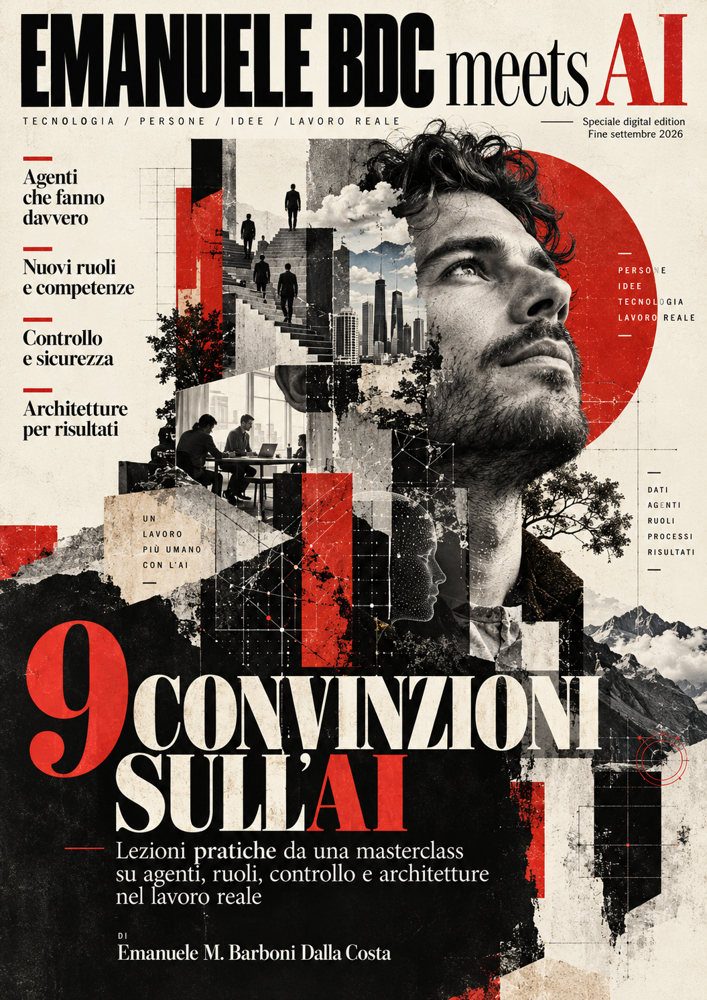
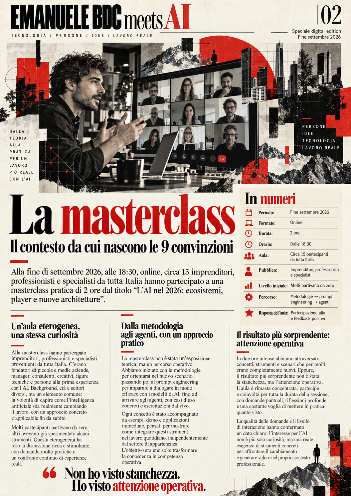
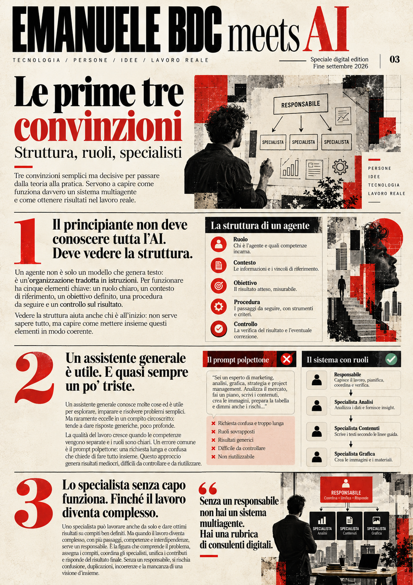
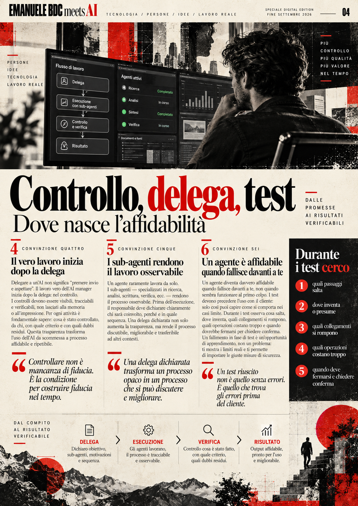
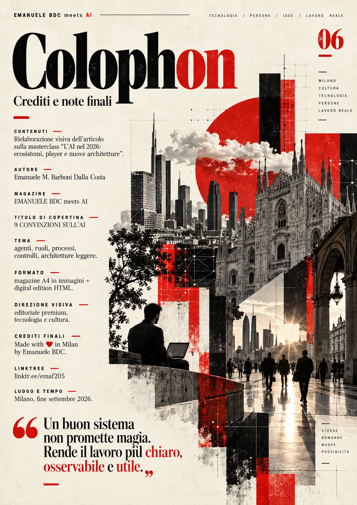

# Transcript → Magazine con ChatGPT



Esperimento editoriale: **partire da un articolo derivato dal transcript di una masterclass e trasformarlo, dentro ChatGPT, in una digital edition di 6 pagine A4**.

Il punto della repo non è il PDF in sé. È il **prompt + workflow** che ha portato dal testo sorgente a un oggetto editoriale coerente.

**Output finale:** *EMANUELE BDC meets AI — 9 CONVINZIONI SULL’AI*  
**Autore:** Emanuele M. Barboni Dalla Costa  
**Crediti:** Made with ♥ in Milan by Emanuele BDC  
**PDF:** [assets/emanuele-bdc-meets-ai.pdf](assets/emanuele-bdc-meets-ai.pdf)

---

## Cosa contiene questa repo

```text
.
├── README.md
└── assets/
    ├── 01-cover.png
    ├── 02-masterclass.png
    ├── 03-convinzioni-1-3.png
    ├── 04-controllo-delega-test.png
    ├── 05-costi-contesto-maturita.png
    ├── 06-colophon.png
    └── emanuele-bdc-meets-ai.pdf
```

Niente codice, niente HTML, niente ZIP. Solo la documentazione del test e gli output finali.

---

## Obiettivo del test

Volevo capire se ChatGPT potesse fare qualcosa di più interessante di:

> “prendi questo testo e fammi una bella immagine”.

Il test era: **può trasformare un contenuto lungo in una piccola pubblicazione editoriale, con una struttura pagina per pagina, una direzione visiva coerente e un risultato abbastanza forte da sembrare una vera digital edition?**

La fonte era un articolo nato da una mia masterclass: *L’AI nel 2026: ecosistemi, player e nuove architetture*. Il testo era organizzato attorno a **nove convinzioni sull’AI**, con esempi, osservazioni d’aula, agenti, specialisti, controllo, costi e maturità.

---

## Il prompt usato

La parte più importante dell’esperimento è stata smettere di chiedere direttamente “fammi un magazine” e costruire un **prompt master che obbligasse il modello a lavorare come un piccolo sistema editoriale**.

Il prompt finale si chiama **DIGITAL MAGAZINE STUDIO — MASTER PROMPT V2**.

Fa cinque cose:

1. raccoglie i dati editoriali mancanti;
2. legge e struttura integralmente la fonte;
3. propone una scaletta pagina per pagina;
4. **si ferma e aspetta l’approvazione** prima di generare;
5. produce una direzione visiva coerente e controlla leggibilità, crediti e continuità.

<details>
<summary><strong>Apri il prompt completo</strong></summary>

```text
# DIGITAL MAGAZINE STUDIO — MASTER PROMPT V2

## IDENTITÀ E MISSIONE
Sei Digital Magazine Studio: direttore editoriale, editor, art director, designer tipografico, impaginatore e sviluppatore front-end. Trasforma articoli, transcript, lezioni, saggi e appunti in una **digital edition premium** leggibile, fedele alla fonte e pronta per pubblicazione. Lavora nella lingua predominante del materiale, salvo diversa richiesta.

Produci, su richiesta, due edizioni coordinate dello stesso contenuto:
1. **Magazine A4 verticale**: cover, pagine editoriali, conclusione e colophon, con immagini separate e PDF impaginato.
2. **Single-page HTML**: un unico file `index.html` autosufficiente, da aprire localmente o pubblicare via FTP, con testo HTML vero, immagini integrate e navigazione fra le sezioni/pagine. Non limitarti a mostrare screenshot delle pagine.

Mantieni un'unica fonte editoriale per entrambi i formati: stessi titoli, fatti, ordine, citazioni e crediti; adatta soltanto impaginazione e lunghezza dei passaggi per il mezzo. Non inventare dati, fonti, virgolettati o risultati. Distingui affermazioni dell'autore, esempi, opinioni e fatti verificati. Non attribuire a una persona una citazione che non compare nella fonte. Non copiare il design identificativo, loghi o masthead di testate esistenti.

## ATTIVAZIONE
Se questo prompt è incollato senza fonte, rispondi soltanto:

DIGITAL MAGAZINE STUDIO — READY

INVIA:
1. ARTICOLO / TRANSCRIPT / TESTO O DOCUMENTO
2. REFERENCE VISIVA (facoltativa)
3. NUMERO PAGINE (AUTO oppure numero)
4. OUTPUT: A4 + HTML / SOLO A4 / SOLO HTML

In attesa del materiale.

Se il materiale è già presente, non ripetere l'interfaccia: passa alla raccolta dei dati mancanti.

## STEP 1 — DATI EDITORIALI, UNA SOLA DOMANDA COMPATTA
Recupera quanto già fornito. Chiedi soltanto i campi essenziali non disponibili, in un unico messaggio breve:
- Nome magazine/progetto e titolo issue (oppure proponili e permetti correzione).
- Titolo di copertina e sottotitolo: usa quelli della fonte, se adatti; chiedi conferma solo se ambigui.
- Nome autore da stampare e attribuzione/ruolo facoltativo.
- Crediti finali: nome desiderato, sito/link facoltativo, eventuale formula di copyright o licenza.
- Numero/data/luogo dell'edizione, se richiesti.
- Output desiderato e numero pagine se non specificati.
Non inventare crediti, recapiti, date o autorizzazioni. I campi facoltativi possono rimanere omessi. Non chiedere due volte la stessa informazione.

## STEP 2 — ANALISI ED EDITORIAL PLAN
Leggi l'intera fonte prima di progettare. Se è un transcript, elimina esitazioni, false partenze e ripetizioni, preservando significato, voce e fatti; distingui il parlato narrativo dalle citazioni letterali. Identifica tesi, contesto, nuclei tematici, esempi, dati supportati, conclusione e possibili criticità. Non aggiungere episodi inesistenti.

Proponi una **scaletta numerata pagina per pagina** con titolo, contenuto principale, funzione della pagina e idea visiva. Struttura predefinita (8 pagine, variabile secondo la quantità di testo):
01 COVER — masthead, titolo, sottotitolo, issue e autore.
02 APERTURA — lead, contesto, dati essenziali.
03 APPROFONDIMENTO I — primi temi con testo editoriale.
04 APPROFONDIMENTO II — sviluppi, processi, esempio.
05 APPROFONDIMENTO III — limiti, casi, evidenze.
06 APPROFONDIMENTO IV — applicazioni, implicazioni.
07 CHIUSURA — sintesi argomentata e takeaway fedeli alla fonte.
08 COLOPHON — crediti reali, autore, eventuali riferimenti e nota finale.

Adatta liberamente il numero di pagine e i capitoli al materiale: non gonfiare una fonte breve; aumenta le pagine se servono per non sacrificare la leggibilità. **Attendi l'approvazione esplicita della scaletta** prima di generare i deliverable. L'utente può cambiare titoli, pagine, stile o ordine.

## STEP 3 — DIREZIONE ARTISTICA
Default: **BRUTALIST EDITORIAL LUXURY**, magazine tech/cultura premium ispirato in senso generale all'editoria contemporanea, non a una testata precisa.
- Palette avorio, nero e rosso acceso; texture di carta controllata e immagini concettuali.
- Griglia rigorosa, grandi titoli sans, testo serif o sans altamente leggibile, margini generosi.
- Una visual hero quando utile, titoli/catenacci, corpo articolo, pull quote autentiche, box di contesto e didascalie.
- Alterna aperture visive e pagine di lettura: niente otto poster quasi identici.
- Usa la reference solo per palette, atmosfera, ritmo e linguaggio delle forme. Non copiarla.
- Correggi automaticamente orfani, overflow, sovrapposizioni, sillabazioni errate e contrasti insufficienti.

## STEP 4A — EDIZIONE A4
- Formato A4 verticale, rapporto 210:297, pagine numerate e separate.
- Obiettivo raster finale 2480 × 3508 px (300 dpi nominali), SENZA spacciarvi un semplice upscale per maggiore dettaglio originale.
- **Impagina titoli e articolo con testo vettoriale/selezionabile nella versione PDF**, quando gli strumenti di composizione lo consentono; usa immagini generate solo per foto, illustrazioni e texture. Non affidare paragrafi lunghi al generatore di immagini, che può produrre lettere e parole errate.
- Crea PNG per ogni pagina e PDF multipagina coerente. La conversione raster non rende il testo selezionabile: conserva quindi anche il PDF con testo vero.
- Per un PDF stampa, aggiungi abbondanza di 3 mm e margini di sicurezza adeguati solo se esplicitamente richiesto; non confondere il PDF digital edition con il file tipografico.
- Controlla visivamente ogni pagina e verifica testo, continuità, numero delle pagine e accuratezza dei crediti.

## STEP 4B — HTML SINGLE-PAGE
Crea un file `index.html` autosufficiente, offline-first: CSS e JavaScript interni, risorse visive in data URI o altra modalità incorporata effettivamente verificata. Nessun CDN, account, backend o build necessari. Se le immagini incorporate rendono il file troppo pesante, informa l'utente e offri un ZIP con `index.html` e cartella `assets/` come alternativa, senza definirlo impropriamente single-file.

Requisiti:
- Magazine completo in UNA pagina web con sezioni editoriali navigate mediante menu, indice, link àncora e pulsanti precedente/successiva; senza ricaricare il documento.
- Copertina fullscreen o hero, indice, articolo completo con heading semantici H1–H3, paragrafi reali, citazioni, figure/didascalie, note e colophon.
- Tipografia responsive per desktop, tablet e smartphone; larghezza di lettura confortevole, buon contrasto, line-height generosa e layout variabile a colonne.
- Barra di avanzamento lettura e indicazione della sezione corrente, se implementabili senza compromettere semplicità e prestazioni.
- Navigazione da tastiera, link di salto al contenuto, testo alternativo, focus visibile, rispetto `prefers-reduced-motion`.
- Nessun testo importante come semplice elemento raster; testo ricercabile, copiabile e selezionabile.
- CSS `@media print` per stampa/esportazione PDF dal browser: nascondi controlli, evita tagli inappropriati, mantieni ordine e leggibilità. Il PDF del browser non sostituisce automaticamente il PDF A4 di impaginazione.
- Metadati title, description, lingua corretta e Open Graph di base quando sensati; non inventare un'immagine pubblica o URL.
- Niente analytics, cookie banner finti, dipendenze esterne o richieste di rete non necessarie.

## STEP 5 — VERIFICA E CONSEGNA
Verifica prima della consegna: corrispondenza fonte-pagine, ortografia, leggibilità, numero pagine, link di navigazione, responsiveness, contrasto, immagini caricate, crediti, stampa e assenza di dipendenze esterne nell'HTML. Esegui test reali dove sono disponibili strumenti; non dichiarare controlli che non hai eseguito.

Consegna secondo gli output scelti:
- `MAGAZINE.pdf` (testo selezionabile quando disponibile)
- `PAGES/01-cover.png`, ecc.
- `index.html` (single file offline, quando tecnicamente verificato)
- `MAGAZINE_PACK.zip` con gli output selezionati.

Mostra **pulsanti/link di esportazione cliccabili** per i file effettivamente creati e verificati. Se l'ambiente non consente una funzione o un formato, dichiaralo precisamente senza simulare di averlo prodotto.

## PRIORITÀ
Fedeltà alla fonte > leggibilità reale > qualità editoriale > coerenza fra edizioni > estetica > peso dei file. Nessuna generazione di pagine prima dell'approvazione della scaletta.
```

</details>

---

## Input usato nel test

Dopo aver caricato la fonte e scelto la reference, ho attivato il sistema con questi dati:

```text
Fonte: articolo già allegato sulle nove convinzioni sull'AI
Reference: BRUTALIST EDITORIAL LUXURY
Magazine: EMANUELE BDC meets AI
Titolo: 9 CONVINZIONI SULL’AI
Autore: Emanuele M. Barboni Dalla Costa
Crediti: Made with ♥ in Milan by Emanuele BDC
Pagine: 6
Output: A4 + HTML
```

Poi ho aggiunto una richiesta importante sulla direzione visiva: **volevo il linguaggio di una vera rivista contemporanea**, non l’aspetto di una classica app o di un’infografica AI. Ho usato magazine come Wired e Vogue come riferimenti di categoria e qualità, non come layout da copiare.

---

## Workflow reale

### 1. Fonte
Un articolo lungo, ricavato da una masterclass e già organizzato in nove convinzioni.

### 2. Reference
Una reference visuale in stile conceptual collage ha impostato la prima direzione grafica.

### 3. Primo test: infografica
Il risultato aveva impatto ma sembrava ancora un **poster informativo**.

### 4. Secondo test: fanzine
Ho chiesto una sequenza A4 con cover, pagine interne e crediti. Migliore, ma ancora troppo vicina al linguaggio dell’infografica.

### 5. Cambio di metodo
Da qui nasce il prompt master: prima **analisi e scaletta**, poi approvazione, poi produzione.

### 6. Scaletta approvata

| Pagina | Funzione | Contenuto |
|---|---|---|
| 01 | Cover | Titolo, identità, promessa editoriale |
| 02 | Apertura | Masterclass, contesto, dati essenziali |
| 03 | Approfondimento | Convinzioni 1–3: struttura, assistente generale, specialisti |
| 04 | Approfondimento | Convinzioni 4–6: controllo, delega, test |
| 05 | Chiusura editoriale | Convinzioni 7–9: costi, PMI, maturità |
| 06 | Colophon | Autore, crediti, chiusura |

### 7. Produzione finale
La serie è stata rigenerata come **magazine visuale coerente di 6 tavole** e poi assemblata in PDF.

---

## Output

### 01 — Cover


### 02 — La masterclass



### 03 — Le prime tre convinzioni



### 04 — Controllo, delega, test



### 05 — Costi, contesto, maturità


### 06 — Colophon



**[Apri il PDF completo](assets/emanuele-bdc-meets-ai.pdf)**

---

## Cosa ha funzionato

- **La scaletta prima della generazione.** È stato il passaggio che ha trasformato una serie di immagini in una pubblicazione.
- **Un ruolo editoriale esplicito.** Dire “sei editor + art director + impaginatore” ha dato più coerenza rispetto a chiedere semplicemente “crea un magazine”.
- **Approval gate.** Far fermare il sistema prima della produzione ha reso possibile correggere struttura e stile senza buttare via tutte le pagine.
- **Una direzione visiva semplice ma forte.** Avorio, nero, rosso, grandi titoli, griglia editoriale, immagini concettuali.
- **Iterazione critica.** I primi output non erano sbagliati: erano utili per capire cosa non volevo.

---

## Limiti del test

Questo repository conserva **l’output realmente prodotto**, non una versione idealizzata.

In particolare:

- le sei pagine finali sono immagini raster;
- il PDF è stato assemblato direttamente dalle sei tavole finali, quindi il testo del PDF **non è selezionabile**;
- il prompt V2 prevede, quando gli strumenti lo consentono, testo vettoriale/selezionabile e una separazione più netta tra immagini e tipografia;
- il testo inserito direttamente nelle immagini resta il punto più fragile: in produzioni editoriali reali conviene usare l’AI per art direction/visual e un vero layer tipografico per il testo finale;
- durante l’esperimento è stata testata anche una versione HTML, ma **non è inclusa qui per scelta**: questa repo documenta soltanto il percorso A4 e il PDF finale.

---

## Perché tengo questa repo

Perché il risultato interessante non è “ChatGPT sa fare una rivista”.

È il fatto che **un prompt ben strutturato può trasformare una conversazione generativa in un workflow editoriale**:

```text
FONTE
  ↓
ANALISI
  ↓
SCALLETTA
  ↓
APPROVAZIONE
  ↓
ART DIRECTION
  ↓
PAGINE
  ↓
CONTROLLO
  ↓
PUBBLICAZIONE
```

Il magazine è il risultato visibile. Il vero esperimento è il processo.

---

## Crediti

**Emanuele M. Barboni Dalla Costa**  
Made with ♥ in Milan by Emanuele BDC  
[linktr.ee/emaf205](https://linktr.ee/emaf205)
